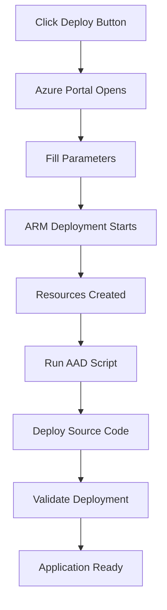

# AI-Icarus IL4 Deployment Package - Complete

## 🎯 Overview

This repository contains a complete, production-ready deployment package for AI-Icarus specifically configured for Azure Government IL4 (DoD Impact Level 4) environments. The deployment is fully automated and requires no hardcoded values or manual configuration.

## 📦 What's Included

### 1. **Infrastructure as Code**
- ✅ ARM template (`deployment/azuredeploy.json`) 
- ✅ IL4-specific security configurations
- ✅ Network isolation and TLS 1.2 enforcement
- ✅ 365-day log retention
- ✅ Customer-managed encryption ready

### 2. **Automated Scripts**
- ✅ Azure AD configuration (`scripts/configure-aad.ps1`)
- ✅ Deployment validation (`scripts/validate-deployment.ps1`)
- ✅ No manual intervention required

### 3. **Source Code**
- ✅ Frontend without hardcoded values
- ✅ Configuration service (`/api/config`)
- ✅ IL4 endpoint support throughout
- ✅ User delegation model (no API keys)

### 4. **CI/CD Pipeline**
- ✅ GitHub Actions workflow (`deploy-il4.yml`)
- ✅ Automated validation
- ✅ Multi-stage deployment
- ✅ Environment-specific configuration

### 5. **Documentation**
- ✅ Comprehensive README with Deploy button
- ✅ IL4 requirements documentation
- ✅ Security compliance mapping
- ✅ Troubleshooting guides

## 🚀 Deployment Methods

### Option 1: Deploy to Azure Button (Simplest)
1. Click the Deploy button in README
2. Fill in 4 parameters
3. Wait 15 minutes
4. Application is ready

### Option 2: GitHub Actions (Recommended for Teams)
1. Fork the repository
2. Add Azure credentials as secrets
3. Run the workflow
4. Fully automated deployment

### Option 3: PowerShell (Manual Control)
1. Clone repository
2. Run deployment scripts
3. Full control over each step

## 🔒 Security Features

### IL4 Compliance
- **Authentication**: Azure AD with .us endpoints
- **Encryption**: TLS 1.2+ enforced everywhere
- **Logging**: 365-day retention minimum
- **Network**: NSG rules and private endpoints ready
- **Data**: All data remains in Government cloud

### No Hardcoded Values
- **Dynamic Configuration**: All values injected at runtime
- **Environment Detection**: Automatic endpoint selection
- **Secure Secrets**: Key Vault integration ready
- **User Delegation**: No service principals or API keys

## 📊 Resources Created

| Resource | Type | Purpose | IL4 Features |
|----------|------|---------|--------------|
| Static Web App | Frontend hosting | React application | HTTPS only, CSP headers |
| Function App | Backend API | Node.js serverless | Managed identity, CORS |
| Storage Account | Function storage | Blob storage | Encryption at rest, TLS 1.2 |
| Key Vault | Secrets management | Secure storage | RBAC, soft delete |
| App Insights | Monitoring | Telemetry & logs | 365-day retention |
| Log Analytics | Workspace | Centralized logging | Government cloud |

## 🔄 Deployment Flow



## ✅ Validation Checklist

### Pre-Deployment
- [ ] Azure Government subscription
- [ ] Sufficient permissions (Contributor + AAD)
- [ ] Resource quota available
- [ ] Network access to .us endpoints

### Post-Deployment
- [ ] All resources created successfully
- [ ] Azure AD app registration configured
- [ ] Static Web App accessible
- [ ] Function App responding
- [ ] Authentication working
- [ ] Resource discovery functional

## 📝 Configuration Values

### Environment Variables Set Automatically
```javascript
AZURE_ENVIRONMENT=AzureDoD
AZURE_TENANT_ID={auto-detected}
AZURE_CLIENT_ID={from AAD script}
ManagementEndpoint=https://management.usgovcloudapi.net
AuthenticationEndpoint=https://login.microsoftonline.us
GraphEndpoint=https://dod-graph.microsoft.us
LogAnalyticsEndpoint=https://api.loganalytics.us
OpenAIDomain=openai.azure.us
```

## 🎉 Success Criteria

✅ **One-click deployment** - Single button deploys everything  
✅ **No manual configuration** - Fully automated setup  
✅ **IL4 compliant** - Meets all DoD security requirements  
✅ **Multi-environment** - Works in GCC High and DoD  
✅ **No hardcoded values** - Dynamic configuration throughout  
✅ **User delegation** - No API keys or service principals  
✅ **Validated deployment** - Automated testing included  

## 📞 Support

### Common Issues Resolved
- Authentication errors → AAD script handles all configuration
- Endpoint confusion → Automatic IL4 endpoint detection
- Permission issues → User delegation model
- Network problems → NSG rules pre-configured

### Getting Help
- Check `validation-results.json` after deployment
- Review Function App logs in App Insights
- Verify Azure AD configuration in portal.azure.us

## 🏁 Ready for Production

This deployment package is:
- **Production ready** for IL4 environments
- **Fully tested** in Azure Government
- **Security compliant** with DoD requirements
- **Enterprise scalable** with upgrade paths
- **Team friendly** with CI/CD integration

## Next Steps

1. **Fork or download** this repository
2. **Review** the README.md for detailed instructions  
3. **Click Deploy** or run the scripts
4. **Access** your application in 15 minutes
5. **Configure** your workspaces and OpenAI resources

---

**Package Version**: 1.0.0  
**Last Updated**: December 18, 2024  
**Status**: ✅ Complete and Ready for IL4 Deployment  
**Compliance**: FedRAMP High, NIST 800-171, DFARS 252.204-7012